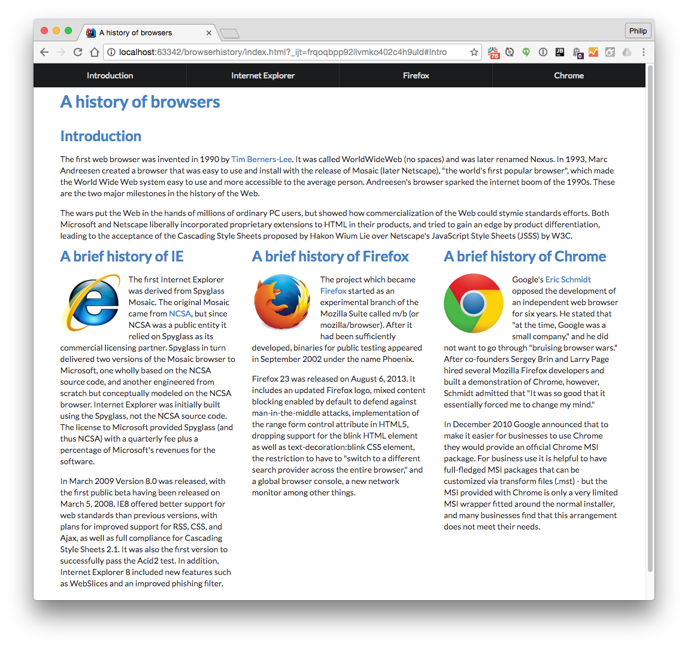

## Easy way to glam up your page

As a front-end development framework, Semantic UI helps beautify HTML-based websites. It is like putting instant makeup that is purposely made to be easy to use and apply to your face. It is like an all-in-one kind of foundation or face moisturizer. I’m not saying it is the greatest and all that but it's good in a sense of its convenience.

But can we say it's convenient to use as an all-in-one makeup?

It is my first time using such a framework and it's quite interesting to use. At first, it gave me a sense of relief as it did lessen my code and it was quite convenient to use when it already had built-in styles for certain layouts. If we compare the pictures below, you can see how Figure A looks like a website from the 90s while Figure B gives a modern vibe of a website.

If you check out the CSS code for Figure A, you can tell it's basic styling. Meanwhile, Figure B, which has a modern vibe, uses Semantic UI.

***Figure A: Browser History with no Semantic UI***
[1](https://courses.ics.hawaii.edu/ics314s22/morea/ui-basics/experience-browserhistory3.html)

***Figure B: Browser History with Semantic UI***
[2](https://courses.ics.hawaii.edu/ics314s22/morea/ui-frameworks/experience-browserhistory-semantic.html)

## Behind the glam

So is it that convenient? I’d say not entirely. Just like how all-in-one makeup is, sometimes having it all in one means more work. As a lip tint, you can use it for your lips and cheeks as an instant blush. However, you need to exert more “blending” using your finger because you just apply it like a normal way you do on your lips, it might be too much and would leave a stain. TOO MUCH WORK.

As for the Semantic UI, I realize that you still have to customize it according to what you want to the point you are not even sure if the semantic UI you used helped lessen the work you have to do. One thing I realize is that since Semantic UI is ready to use, as a learner, it will just make it easier but at the same time, it will also lessen my learning progress in understanding how to style and what attributes to use. 

Overall, using Semantic UI is not bad. It's great for those who are in a fast environment since it will lessen their time to write down all these styles and attributes, but it is not so great for learners since they will eventually rely on it and not try to understand how to use different styles and attributes.

  
