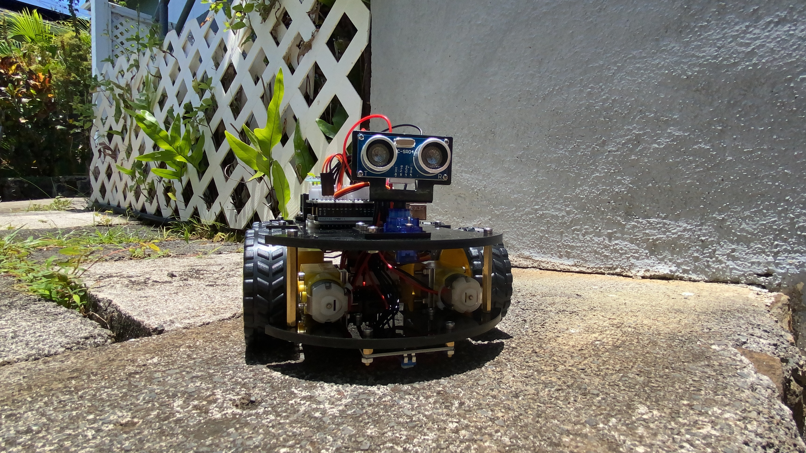

  

## My driving force is… money!

I’ll be honest! The reason why I chose to be in Engineering was because of the good pay. And I am not kidding that money is the driving force behind my motivation to continue college. I am just being real, that is. However, I know that I still have to do work and need to constantly learn to achieve my goals, and get what I want. 

## Software Engineering

I had no idea about Software Engineering when I was young. All I did was play around, dreamt of being a superhero with superpowers, and just lived the life I have at that moment. When I was in 7th grade, I got introduced to Web dev (Website Development). I learned how to code in HTML and CSS which I surprisingly enjoyed using, since it is my first coding. The fact that we were able to create our website from scratch was something I was always proud of to the point we all call ourselves *hackers*.

Since I went to that school that allowed, not only boys, but also girls, to create their own light switch by soldering, connecting circuits, and just working with resistors and wires that usually girls don’t get a chance to work within our country, the Philippines. It was an amazing experience that also helped me now in my technical projects. 

Little by little, I got introduced to Java, JavaScript, C, C++, and Python in highschool and in college. The fun I had when I was in 7th grade helped me choose to stick with engineering and now I want to lean towards robotics. But since I do have more software experience, I get to work on more programming which I extremely think needs more improvement.

## Robots, Projects, Expectations

I am quite fascinated with robotics and how their minds work (or more like how to program their minds). I want to work on more projects that help me learn machine learning, deep learning, artificial intelligence, and computer vision. That is why I am quite lucky to be part of my current rover team, VIP Team RoSE, which is a research project that has a mission to develop a remotely operated rover that will simulate a Mars rover space exploration mission. I’ve been learning how to work with ROS, OpenCV, and Ubuntu, and I also got the chance to work with SolidWorks which I never thought I would be able to use as a computer engineering student.

But then again, you might think that since I have this kind of background, I am already a pro at everything. Well, you are wrong. I still think that my basic skills in programming must be upgraded and that I need to learn more programming styles, practice more, and test them out. Thus taking programming classes is what I hope will help me achieve this goal

## Conclusion

Other than that, I am still hoping that even if I do want money and that it is my *driving force* to stick with engineering, I will enjoy my chosen career path. I know that people change their careers so often but I do hope that what I learned in school, what I cried about failing about, and what I stressed out during college will not be wasted and hopefully be developed through time with continuous learning. *Oh and yeah, I still need to work on my writing skills as well.*

