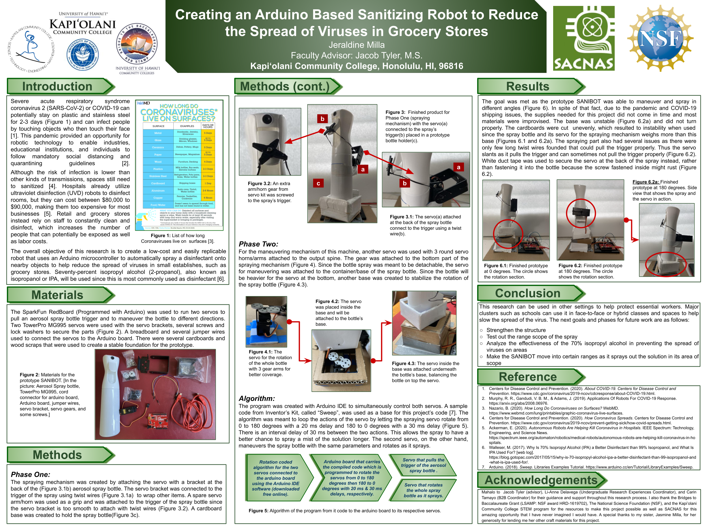

## About Sanibot

As Covid-19 could potentially stay on surfaces for about 2-3 days and grocery stores need their workers to constantly clean their products and the whole store, which would cost a lot plus an increase of labor cost. While there are Ultraviolet Disinfecting or (UVD) robots that Hospitals use to disinfect, they cost around $80-$90,000 each. My objective was to build a low-cost, easily replicable robot prototype that is programmed to spray disinfectant solutions in different directions, called the Sanibot. The Sanibot goes around the area of its scope that sprays a safe 70% isopropyl alcohol that could potentially prevent the spread of the Coronavirus on small establishments such as grocery stores or other high contact areas.

Here's the circuit board and servo:

## Result

The goal was met as the prototype SANIBOT was able to maneuver and spray at different angles. Despite that fact, due to the pandemic and COVID-19 shipping issues, the supplies needed for this project did not come in time and most materials were improvised. The base was unstable and did not turn properly. The cardboards were cut unevenly, which resulted in instability when used since the spray bottle and its servo for the spraying mechanism weigh more than this base. The spraying part also had several issues as there were only a few long twist wires found that could pull the trigger properly. Thus the servo slants as it pulls the trigger and can sometimes not pull the trigger properly. White duct tape was used to secure the servo at the back of the spray instead, rather than fastening it into the bottle because the screw-fastened inside might rust.

## Recap

In this research project, I work on developing a prototype robot that was sanitized, which did not work well. However, I still was able to create the prototype which I presented to the SURF Spring 2020 and SACNAS 2020 conferences. This was programmed in Arduino and used scraps of cardboard to help in creating the base for the spray.

It was quite hard for me to work on a research project since COVID happened, which gave me a reason to create such a project. It was not the bed nor worked well. However, the process of making it and the fact that I was able to get this idea and work on this project alone with no prior experience and less guidance, was a great experience. It also helped me think of ideas that I can do to help my community in times like this. 

In the end, this project was a fail in terms of mechanism but could be developed with the help of other people from different disciplines that could help design a better structure for the Sanibot.

You can learn more about this project by reading my poster: 

