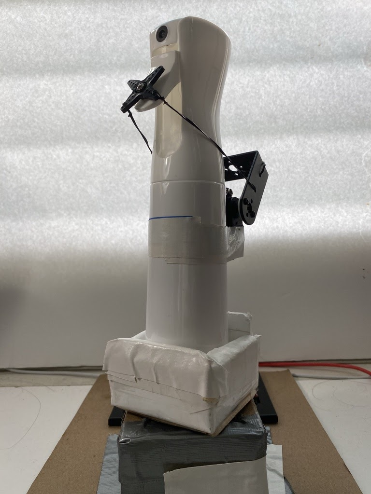

  
  

As Covid-19 could potentially stay on surfaces for about 2-3 days and grocery stores need their workers to constantly clean their products and the whole store, which would cost a lot plus an increase of labor cost. While there are Ultraviolet Disinfecting or (UVD) robots that Hospitals use to disinfect, they cost around $80-$90,000 each. My objective was to build a low-cost, easily replicable robot prototype that is programmed to spray disinfectant solutions in different directions, called the Sanibot. The Sanibot goes around the area of its scope that sprays a safe 70% isopropyl alcohol that could potentially prevent the spread of the Coronavirus on small establishments such as grocery stores or other high contact areas.

You can learn more about this project by reading my poster: 

