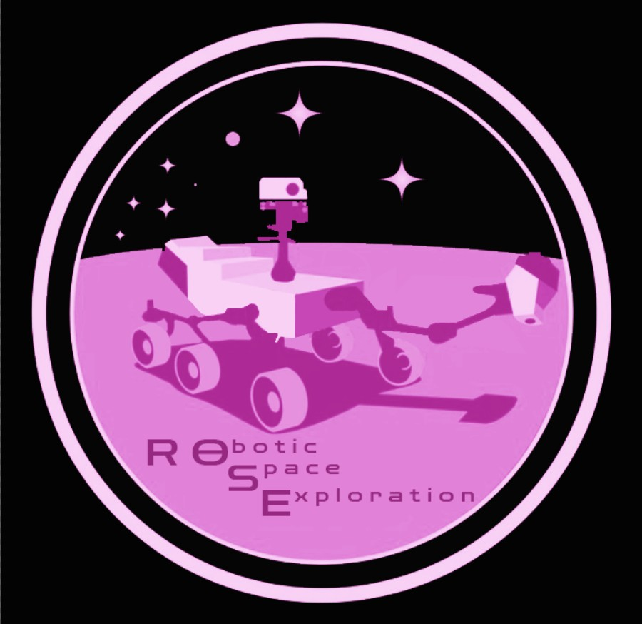
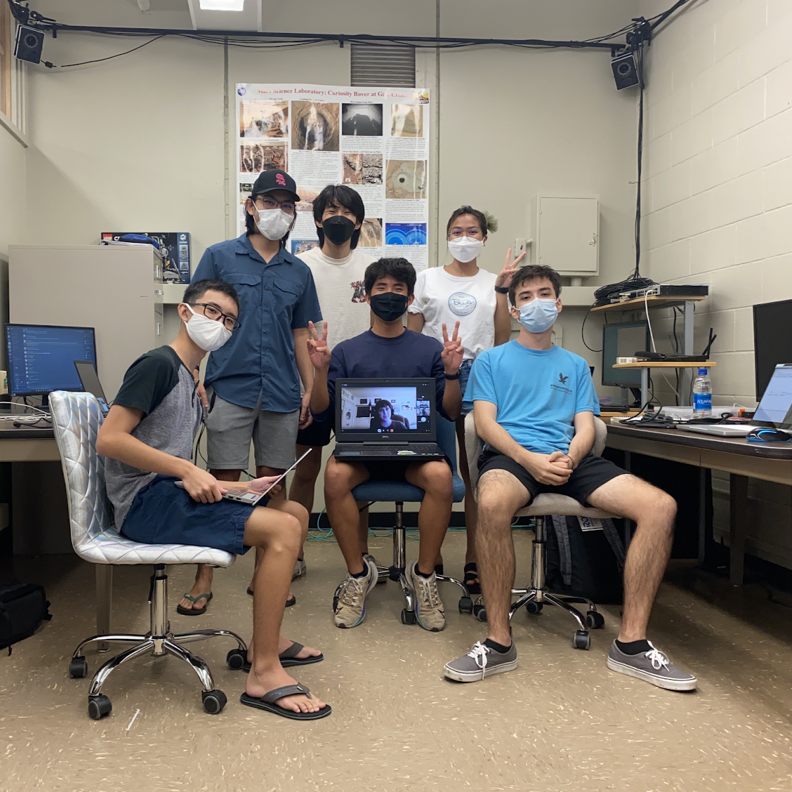
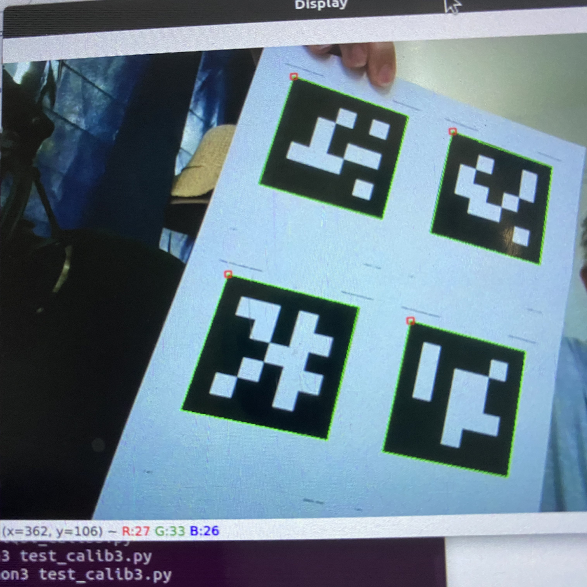

<div class="ui small rounded images">
    
</div>
## About RoSE

VIP Team RoSE is a research project by a team of undergraduate students from multiple disciplines from engineering, business, computer science, biology, and astrogeology that will compete in [The Mars Society's University Rover Challenge (URC)](https://urc.marssociety.org/home). The team's mission is to develop a remotely operated rover that will simulate a Mars rover space exploration mission. There will be four different mission categories in URC: (1) a science mission in which the rover will investigate sample sites for extinct and extant life, (2) a delivery mission to deliver a variety of objects to astronauts in the field across rugged terrain, (3) an equipment servicing mission to perform dexterous operations on a mock lander using a robotic arm, and (4) an autonomous mission to autonomously travel to a series of locations.

## Autonomy

*The autonomous challenge's mission is to autonomously navigate and traverse obstacles, and scan AR tags.* 



One of the subsystems in RoSE that focuses on the Autonomous challenge is called the Autonomy Subsystem, which I am part of. I am one of the programmers of this team that implements software components to meet interface requirements. 

I was able to work on a GPS adapter that converts GPS coordinates to cartesian. Here's a part of the code that I've worked on:
```
//GPSAdapter.cpp

GPSAdapter::~GPSAdapter() {

}

void GPSAdapter::updateInitialGPSPosition(GPSPosition p){
    latInitial = p.lat;
    lonInitial = p.lon;
}

Position GPSAdapter::getPositionAtGPSPosition(GPSPosition p){
    Position pos{p.lat, p.lon};
    
    std::array<double, 2> cartesianPosition = wgs84::toCartesian(WGS84Reference:{latInitial, lonInitial}, WGS84Position:{p.lat, p.lon});
    pos.x = cartesianPosition[0];
    pos.z = cartesianPosition[1];
    
    return pos;
}
```

I also was able to work on creating a prototype computer vision that detects Aruco Tags using OpenCV. Here are some pictures of the prototype I made: 



## Conclusion

Since we are the first-ever rover team at the University of Hawai'i at Manoa (UHM) which just started last year, Spring 2021, we are challenged in a lot of different aspects in establishing a new research and competition team. It was difficult to figure out the steps that we have to work on as we have no prior established work and we have to go from scratch. Luckily, for my subsystem, we are consist of students that are into space-related projects and had some previous experiences, and the others have programming experiences that both helped our team in creating our plan of attack for the whole school year to create working autonomous navigation, localization, and obstacle-detection software package before the competition in June 2022.


To learn more about VIP Team RoSE from our website: [https://manoa.hawaii.edu/uh-vip/project/robotic-space-exploration-rose-vip/](https://manoa.hawaii.edu/uh-vip/project/robotic-space-exploration-rose-vip/)

Follow us on:
[Instagram](instagram.com/uhm_vip_rose/)
[Twitter](https://twitter.com/uhm_vip_rose)


