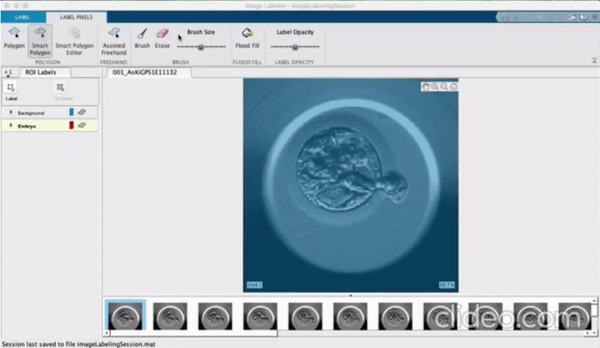
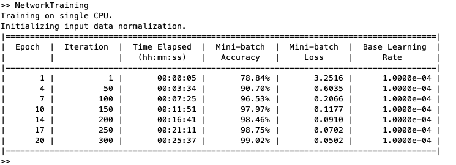

In Summer 2020, I worked on droplet generation which will help diagnose diseases at an earlier stage. Analyzing and training networks to recognize droplets will work towards the goal of computers being able to analyze data on their own to find diseased cells. This research project was under Dr. Aaron Ohta's [Microdevices & Microfluidics Lab](https://sites.google.com/a/hawaii.edu/uh-mnm-lab/members) for the Native Hawaiian Science & Engineering Mentorship Program ([NHSEMP](https://sites.google.com/a/hawaii.edu/nhsemp/home?authuser=0)) [Hawaii PEEC II: Manoa Design Clinic](https://sites.google.com/a/hawaii.edu/nhsemp/what-we-do/summer-programs/m%C4%81noa-design-clinic?authuser=0).

As the Computer Engineering major in the team, I was in charge of preparing the dataset, training the network, and analyzing the data for both embryones and droplet datasets. I mostly worked with MATLAB to prepare my dataset which requires me to trace out each embryo/droplet from a frame in a video, which usually requires 1000+ frames to be used in training the network.

This project was my first research project which allows me to team up with other students from different disciplines to collaborate our ideas from our perspectives. It was quite challenging working through Zoom, but it worked out well as we also had proper guidance from our TA and advisor. 

Here's the link to our symposium video: [PEEC Manoa - Milla & Siu](https://sites.google.com/hawaii.edu/2020peeciisymposium/uh-m%C4%81noa/milla-siu)

