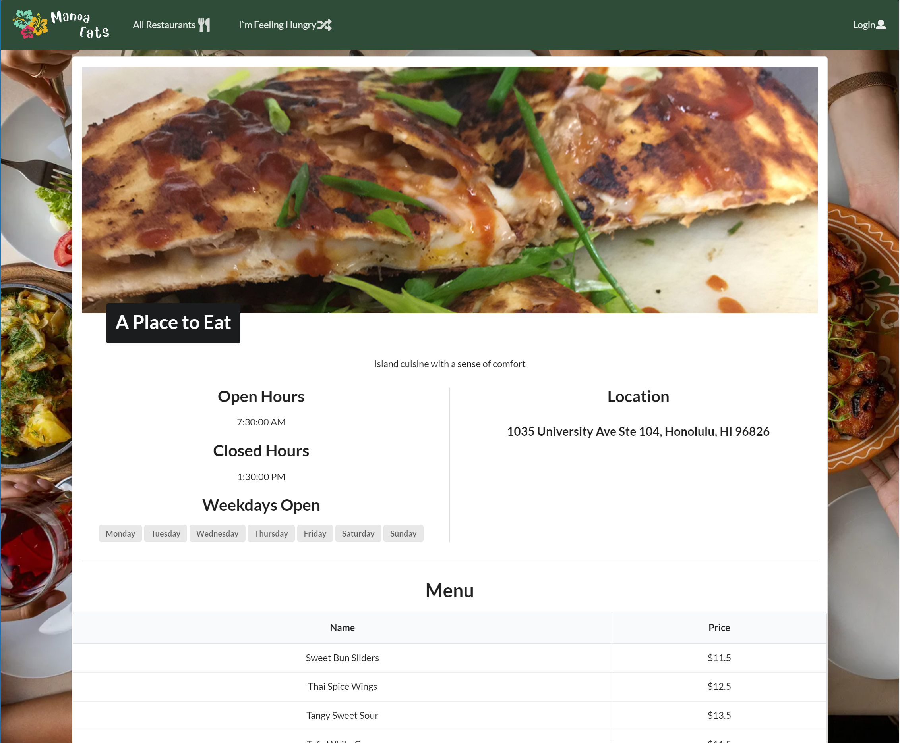

*Checkout our website at [manoa-eats.github.io](https://manoa-eats.github.io) or at our deployed website:[manoa-eats](https://manoa-eats.xyz/#/)*

# Overview

Not many students know about all of our fine dish eateries on the UH Manoa campus. In addition, some students who want to try new restaurants may not get a chance to because they may have time conflicts with their schedule leaving some restaurants having either too many students in line or not enough students.

Thus, Manoa Eats was created ✨

Manoa Eats is a web application that will allow students and staff access to the different eateries information on campus. 

This website aims to give access to hardworking students to nourish their brains with UH’s nutritious food located all around the campus. Students will be able to upload their schedules along with their course locations, and our website will estimate the best restaurant locations to stop at on their path to their next class.

*~this photo shows the landing page of Manoa Eats~*

# Manoa Eats Staff

Manoa Eats is designed, implemented, and maintained by
[Tyler Baguio](https://tylerb8.github.io), [Kristi Chinen](https://kristihchinen.github.io), [Jeraldine Milla](https://itsjerie.github.io), [Nenye Ndili](https://nenyehub.github.io), [Gavin Peng](https://devgav.github.io).

# Reflection

As the team's project manager, I helped the team get our tasks organized and kept our team on track with the deadlines. This task challenged my organization skills and my leadership skills. Giving my memebers a safe space to be open with their ideas and opinions and help moderate discussion, is one of the tasks that I had to work on for this team.

For my contribution for this project, I worked on several parts:
  - created the Logo
  - helped in the aesthetics for the website
  - added the menu data
  - added the restaurant/vendor data
  - created the view restaurant template for its photo, name, description, open & closing hours, location, menu, and review
  - and more in creating the github organization, managing our project boards, and keeping the team on track of the deadlines.

Throughout the project, our team had to collaborate in-person during class days and remotely for most of the time. It was challenging to describe our thought process when its only through messaging, but good thing screensharing was invented and that we could try to desribe each other's ideas virtually. 

If I were to talk about what I learned from this project is that communication. planning, and organization are very important aspects in accomplishing this project. Communication within the team is very essential especially when we all have different ideas and we wanted to excel in this class. Sharing our thoughts and opinion to the team made our work flow smoother. Another thing that made our work smoother was organizing and planning our tasks. The *kanban* board tremendously helped us to keep on track on what we should be working on and having someone delegated to work on specific tasks makes our team work efficiently with the time we have, though most of us were not familiar with this task organizer.

*~the photo below shows the restairants information, menu, and review which I was in charged of creating the template, and inputting all the Menu and restaurants data~*

